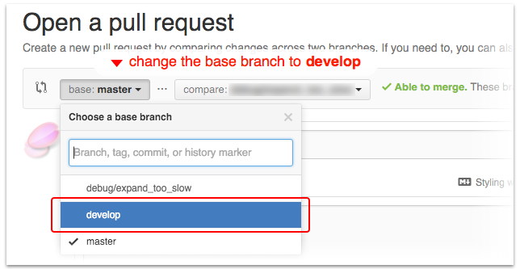

# How to Contribute

## [IMPORTANT] When opening a Pull Request

This project is actively developed on the [`develop`](/h6ah4i/android-advancedrecyclerview/tree/develop) branch. **Please change the base branch to `develop`**.

## Issue reports

When creating an issue report, please provide sufficient information of the issue;

- Version of the Advanced RecyclerView library
- What happens?
- What is the expected behavior?
- How to reproduce?
  - *If the issue is hard to reproduce or only occurs in the specific condition, please upload minimal project which can reproduce the same issue.*

These information are optional but recommended because it also helps me to determine what is wrong.

- Dump of the call stack (if crash occurs)
- Version of the Support libraries
- Android OS version
