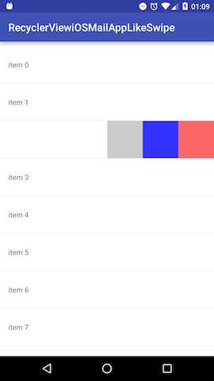

Advanced RecyclerView
===============

This RecyclerView extension library provides Google's Inbox app like swiping, Play Music app like drag-and-drop sorting and expandable item features. Works on API level 14 or later.

**Documentation site**: https://advancedrecyclerview.h6ah4i.com/

[](https://maven-badges.herokuapp.com/maven-central/com.h6ah4i.android.widget.advrecyclerview/advrecyclerview)
[](https://android-arsenal.com/details/1/1432)

---

### Download the example app

<a href="https://play.google.com/store/apps/details?id=com.h6ah4i.android.example.advrecyclerview">

</a>


### Demonstration video on YouTube

<a href="http://www.youtube.com/watch?feature=player_embedded&v=S7cSwMArjUQ" target="_blank">

</a>

---

Target platforms
---

- API level 14 or later


Latest version
---

- Version 1.0.0  (December 16, 2018)   ([RELEASE NOTES](./RELEASE-NOTES.md))


**Recent Breaking Change Info**

- **v1.0.0:**
  - Migrated to AndroidX (Use **v0.11.0** instead if your project uses support libraries)
  - `BaseWrapperAdapter`
  - Removed some deprecated features
    - `SwipeableItemConstants.REACTION_CAN_SWIPE_BOTH`
    - `SwipeableItemConstants.REACTION_CAN_NOT_SWIPE_BOTH`
    - `SwipeableItemConstants.REACTION_CAN_NOT_SWIPE_BOTH_WITH_RUBBER_BAND_EFFECT`
  - New `DraggableItemState getDragState()` method added to the `DraggableItemViewHolder` interface
  - New `SwipeableItemState getSwipeState()` method added to the `SwipeableItemViewHolder` interface
  - New `ExpandableItemState getExpandState()` method added to the `ExpandableItemViewHolder` interface

:point_right: [Migration guide from v0.11.0 to v1.0.0](https://advancedrecyclerview.h6ah4i.com/migration/)


Getting started
---

This library is published on Maven Central. Just add these lines to `build.gradle`.

```diff
repositories {
+     mavenCentral()
}

dependencies {
+     implementation 'com.h6ah4i.android.widget.advrecyclerview:advrecyclerview:1.0.0'
}
```

Please check the [Getting Started section on the official documentation site](https://advancedrecyclerview.h6ah4i.com/getting-started/) for more details.

---

Examples
---

Please check the implementation of the simple examples.

### Drag & Drop related examples

- [Basic](example/src/main/java/com/h6ah4i/android/example/advrecyclerview/demo_d_basic/)
- [Minimal](example/src/main/java/com/h6ah4i/android/example/advrecyclerview/demo_d_minimal/)
- [Draggable grid](example/src/main/java/com/h6ah4i/android/example/advrecyclerview/demo_d_grid/)
- [Draggable staggered grid](example/src/main/java/com/h6ah4i/android/example/advrecyclerview/demo_d_staggered_grid/)
- [Draggable with section](example/src/main/java/com/h6ah4i/android/example/advrecyclerview/demo_d_with_section/)
- [Drag on Long press](example/src/main/java/com/h6ah4i/android/example/advrecyclerview/demo_d_on_longpress/)
- [Uses onCheckCanDrop()](example/src/main/java/com/h6ah4i/android/example/advrecyclerview/demo_d_check_can_drop/)

### Expandable item related examples

- [Basic](example/src/main/java/com/h6ah4i/android/example/advrecyclerview/demo_e_basic/)
- [Minimal](example/src/main/java/com/h6ah4i/android/example/advrecyclerview/demo_e_minimal/)
- [Add & Remove item](example/src/main/java/com/h6ah4i/android/example/advrecyclerview/demo_e_add_remove/)
- [Already expanded groups](example/src/main/java/com/h6ah4i/android/example/advrecyclerview/demo_e_already_expanded/)

### Swipeable related examples

- [Basic](example/src/main/java/com/h6ah4i/android/example/advrecyclerview/demo_s_basic/)
- [Minimal](example/src/main/java/com/h6ah4i/android/example/advrecyclerview/demo_s_minimal/)
- [Swipeable with button](example/src/main/java/com/h6ah4i/android/example/advrecyclerview/demo_s_button/)
- [Vertical](example/src/main/java/com/h6ah4i/android/example/advrecyclerview/demo_s_vertical/)
- [Viewpager](example/src/main/java/com/h6ah4i/android/example/advrecyclerview/demo_s_viewpager/)
- [Swipe on long press](example/src/main/java/com/h6ah4i/android/example/advrecyclerview/demo_s_longpress/)

### Headers and Footers examples
- [Minimal](example/src/main/java/com/h6ah4i/android/example/advrecyclerview/demo_hf_minimal)
- [Expandable with Header/Footer](example/src/main/java/com/h6ah4i/android/example/advrecyclerview/demo_hf_e)
- [Add & Remove Header/Footer items](example/src/main/java/com/h6ah4i/android/example/advrecyclerview/demo_hf_add_remove)

### WrapperAdapter examples
- [Composition of All Features](example/src/main/java/com/h6ah4i/android/example/advrecyclerview/demo_composition_all)
- [Insertion items](example/src/main/java/com/h6ah4i/android/example/advrecyclerview/demo_wa_insertion)
- [Filtering items](example/src/main/java/com/h6ah4i/android/example/advrecyclerview/demo_wa_filtering)

### Hybrid examples

- [Draggable & Swiping](example/src/main/java/com/h6ah4i/android/example/advrecyclerview/demo_ds/)
- [Draggable & Swiping with section](example/src/main/java/com/h6ah4i/android/example/advrecyclerview/demo_ed_with_section/)
- [Expandable & Draggable & Swiping](example/src/main/java/com/h6ah4i/android/example/advrecyclerview/demo_eds/)

### Other examples

#### iOS Mail app like swipe action



- [Repository](https://github.com/h6ah4i/RecyclerViewiOSMailAppLikeSwipe)

---

License
---

This library is licensed under the [Apache Software License, Version 2.0](http://www.apache.org/licenses/LICENSE-2.0).

See [`LICENSE`](LICENSE) for full of the license text.

    Copyright (C) 2015 Haruki Hasegawa

    Licensed under the Apache License, Version 2.0 (the "License");
    you may not use this file except in compliance with the License.
    You may obtain a copy of the License at

        http://www.apache.org/licenses/LICENSE-2.0

    Unless required by applicable law or agreed to in writing, software
    distributed under the License is distributed on an "AS IS" BASIS,
    WITHOUT WARRANTIES OR CONDITIONS OF ANY KIND, either express or implied.
    See the License for the specific language governing permissions and
    limitations under the License.
