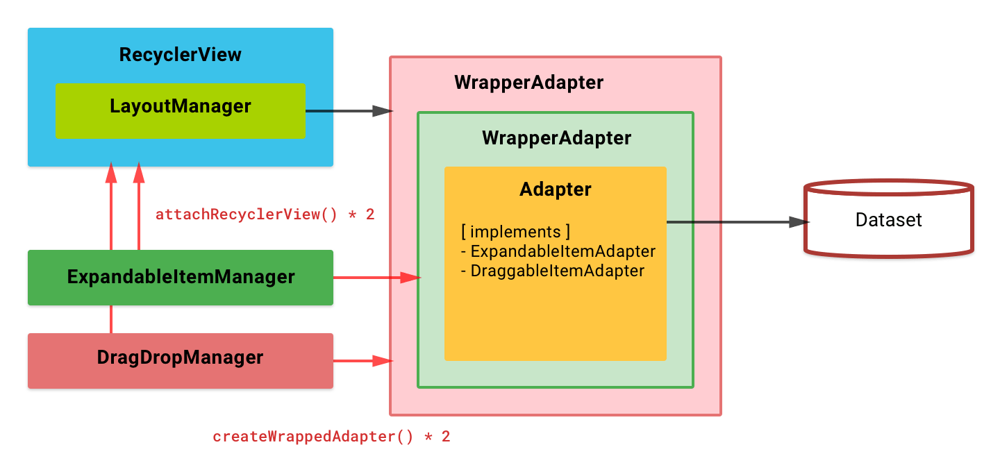
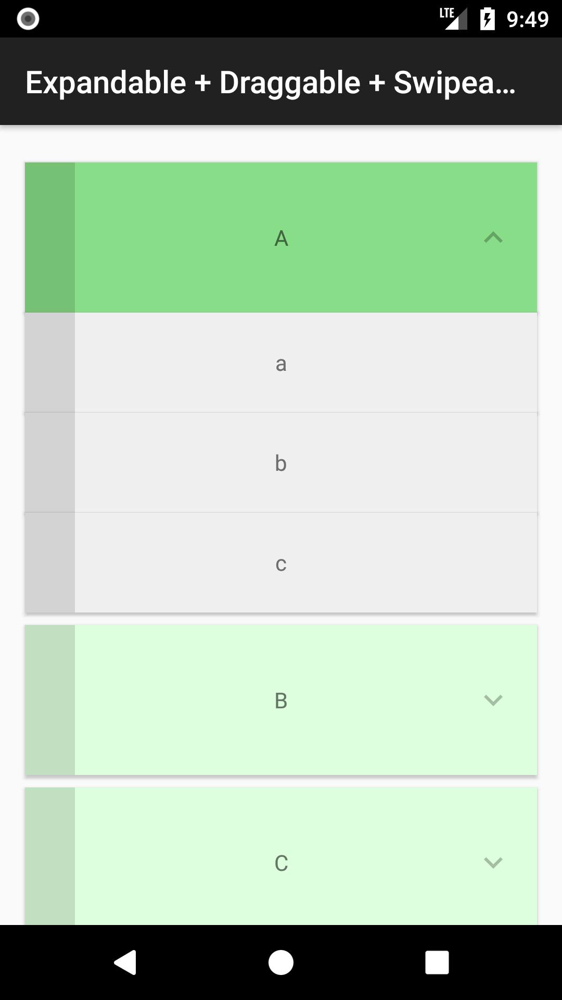

One of the most advanced example which uses Expandable, Draggable and Swipeable features all together.

!!! tip ""
    [:octocat: See the source code on GitHub]({{ library.repo_tree_base }}/example/src/main/java/com/h6ah4i/android/example/advrecyclerview/demo_ed_with_section)

## Block diagram

## Screenshots

| Screenshot 1 | Screenshot 2 |
|--------------|--------------|
|  |  |

