## &raquo; Minimal example

| Screenshot 1 | Screenshot 2 |
|--------------|--------------|
|  | 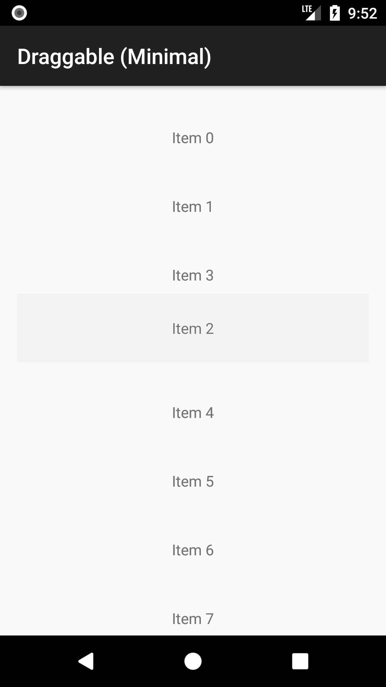 |

!!! tip ""
    [:octocat: See the source code on GitHub]({{ library.repo_tree_base }}/example/src/main/java/com/h6ah4i/android/example/advrecyclerview/demo_d_minimal)

## &raquo; Basic example

| Screenshot 1 | Screenshot 2 |
|--------------|--------------|
| 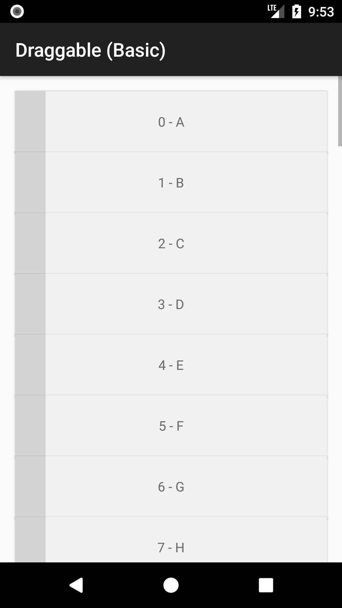 | 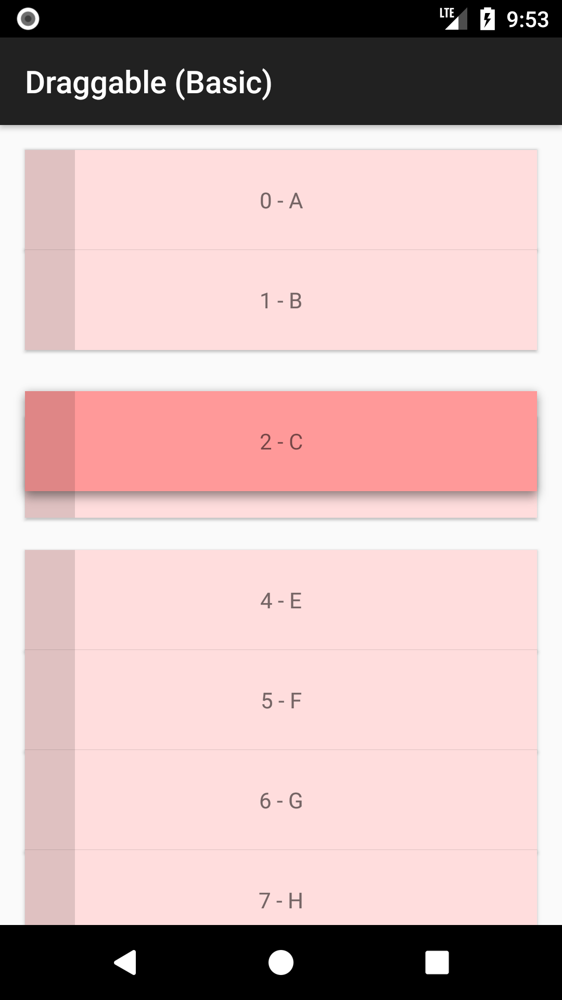 |

!!! tip ""
    [:octocat: See the source code on GitHub]({{ library.repo_tree_base }}/example/src/main/java/com/h6ah4i/android/example/advrecyclerview/demo_d_basic)

## &raquo; Start dragging start on long press

| Screenshot 1 | Screenshot 2 |
|--------------|--------------|
| 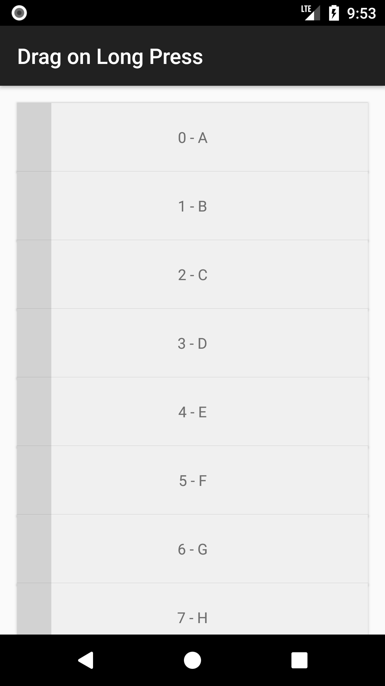 | 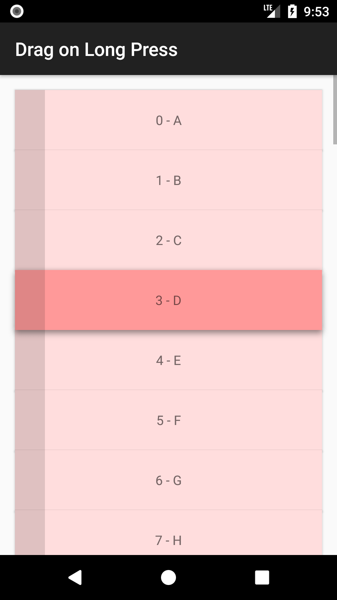 |

!!! tip ""
    [:octocat: See the source code on GitHub]({{ library.repo_tree_base }}/example/src/main/java/com/h6ah4i/android/example/advrecyclerview/demo_d_on_longpress)

## &raquo; Draggable with Sections

| Screenshot 1 | Screenshot 2 |
|--------------|--------------|
| 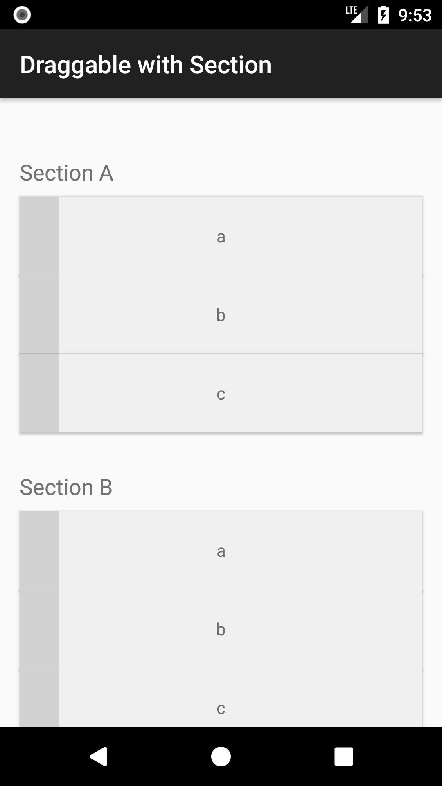 | 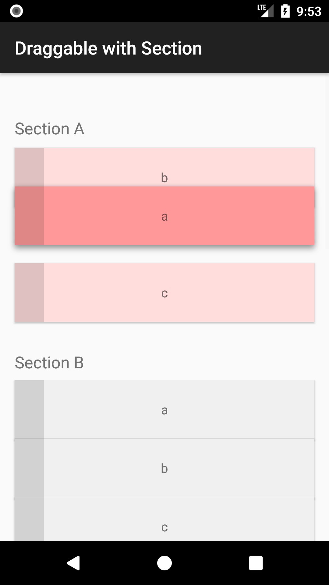 |

!!! tip ""
    [:octocat: See the source code on GitHub]({{ library.repo_tree_base }}/example/src/main/java/com/h6ah4i/android/example/advrecyclerview/demo_d_with_section)

## &raquo; Uses onCheckCanDrop()

| Screenshot 1 | Screenshot 2 |
|--------------|--------------|
|  | 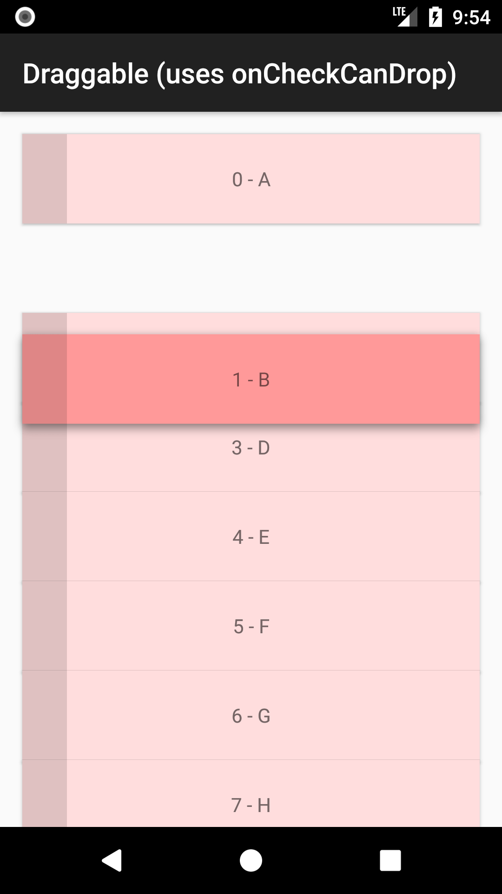 |

!!! tip ""
    [:octocat: See the source code on GitHub]({{ library.repo_tree_base }}/example/src/main/java/com/h6ah4i/android/example/advrecyclerview/demo_d_check_can_drop)

## &raquo; With GridLayoutManager

| Screenshot 1 | Screenshot 2 |
|--------------|--------------|
| 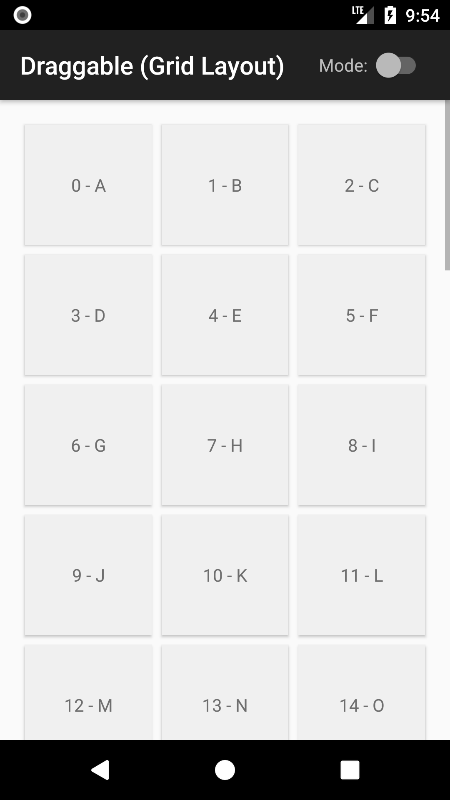 | 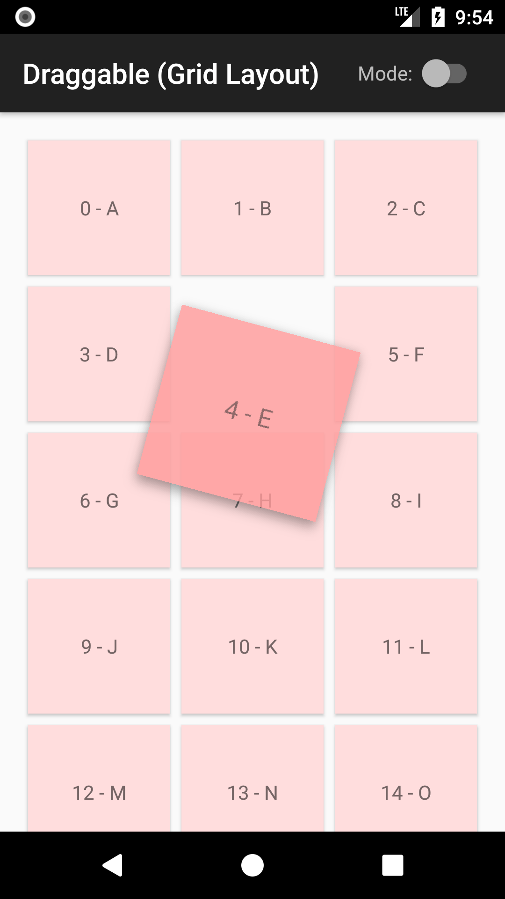 |

!!! tip ""
    [:octocat: See the source code on GitHub]({{ library.repo_tree_base }}/example/src/main/java/com/h6ah4i/android/example/advrecyclerview/demo_d_grid)

## &raquo; With StaggeredGridLayoutManager

| Screenshot 1 | Screenshot 2 |
|--------------|--------------|
|  | 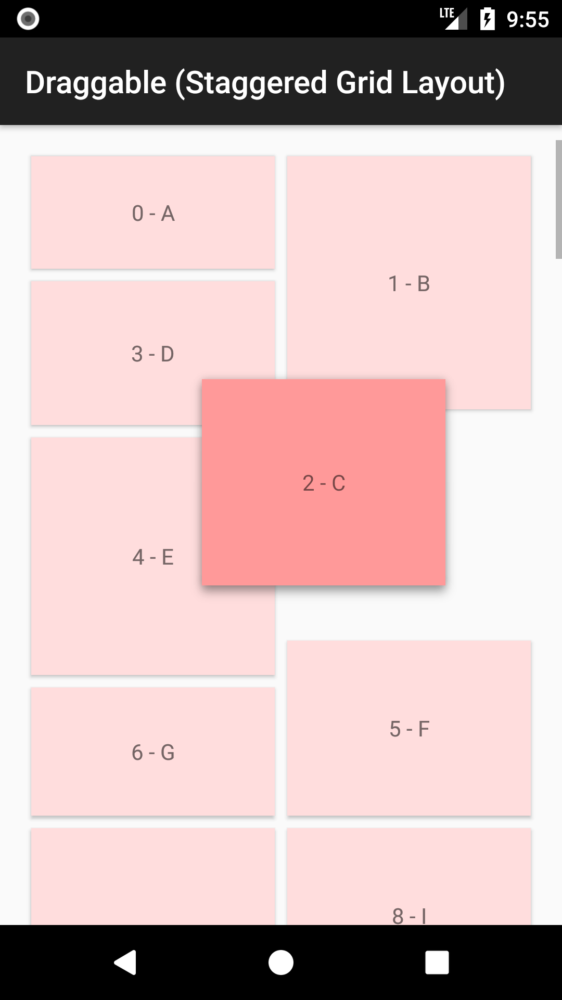 |

!!! tip ""
    [:octocat: See the source code on GitHub]({{ library.repo_tree_base }}/example/src/main/java/com/h6ah4i/android/example/advrecyclerview/demo_d_staggered_grid)

