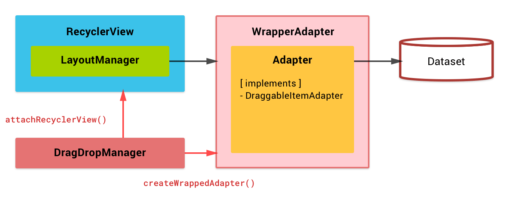

## Block diagram

## Classes / Interfaces

| Class/Interface name                  |  Javadoc  | Description                                              |
|---------------------------------------|-----------|----------------------------------------------------------|
| [:octocat: `RecyclerViewDragDropManager`](https://github.com/h6ah4i/android-advancedrecyclerview/blob/master/library/src/main/java/com/h6ah4i/android/widget/advrecyclerview/draggable/RecyclerViewDragDropManager.java)   | [:blue_book: View](/javadoc/reference/com/h6ah4i/android/widget/advrecyclerview/draggable/RecyclerViewDragDropManager.html) | Provides Drag & Drop sort operation                         |
| [:octocat: `DraggableItemAdapter<T>`](https://github.com/h6ah4i/android-advancedrecyclerview/blob/master/library/src/main/java/com/h6ah4i/android/widget/advrecyclerview/draggable/DraggableItemAdapter.java)              | [:blue_book: View](/javadoc/reference/com/h6ah4i/android/widget/advrecyclerview/draggable/DraggableItemAdapter.html) | Implement this interface on your RecyclerView.Adapter       |
| [:octocat: `DraggableItemViewHolder`](https://github.com/h6ah4i/android-advancedrecyclerview/blob/master/library/src/main/java/com/h6ah4i/android/widget/advrecyclerview/draggable/DraggableItemViewHolder.java)           | [:blue_book: View](/javadoc/reference/com/h6ah4i/android/widget/advrecyclerview/draggable/DraggableItemViewHolder.html) | Implement this interface on your RecyclerView.ViewHolder    |
| [:octocat: `DraggableItemConstants`](https://github.com/h6ah4i/android-advancedrecyclerview/blob/master/library/src/main/java/com/h6ah4i/android/widget/advrecyclerview/draggable/DraggableItemConstants.java)             | [:blue_book: View](/javadoc/reference/com/h6ah4i/android/widget/advrecyclerview/draggable/DraggableItemConstants.html) | Constant values area declared in this interface            |
| [:octocat: `DraggableItemAnimator`](https://github.com/h6ah4i/android-advancedrecyclerview/blob/master/library/src/main/java/com/h6ah4i/android/widget/advrecyclerview/animator/DraggableItemAnimator.java)                | [:blue_book: View](/javadoc/reference/com/h6ah4i/android/widget/advrecyclerview/animator/DraggableItemAnimator.html) | An ItemAnimator which implements special drag & drop effect |

