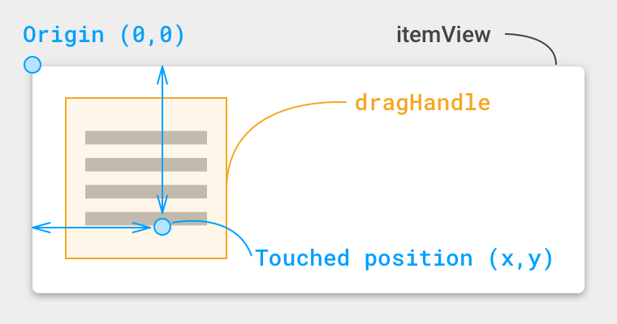

!!! tip "Just looking for a sample code?"
    :octocat: Check the [minimal drag & drop sample code on GitHub](https://github.com/h6ah4i/android-advancedrecyclerview/blob/master/example/src/main/java/com/h6ah4i/android/example/advrecyclerview/demo_d_minimal/MinimalDraggableExampleActivity.java).

## Tutorial

### Step 1. Make the adapter supports stable IDs

!!! attention
    **This step is very important. If adapter does not return stable & unique IDs, that will cause some weird behaviors (wrong animations, NPE, etc...)**

```java
class MyAdapter extends RecyclerView.Adapter<MyAdapter.MyViewHolder> {
    MyAdapter() {
        setHasStableIds(true);
    }

    @Override
    public long getItemId(int position) {
        // requires static value, it means need to keep the same value
        // even if the item position has been changed.
        return mItems.get(position).getId();
    }
}
```

### Step 2. Modify layout file of item views

Put a drag handle view to the layout XML of item view.


```xml
<!-- for itemView -->
<FrameLayout
    xmlns:android="http://schemas.android.com/apk/res/android"
    android:layout_width="match_parent"
    android:layout_height="56dp">
    <!-- Content View(s) -->
    <TextView
        android:id="@android:id/text1"
        android:layout_width="match_parent"
        android:layout_height="match_parent"
        android:gravity="center"/>
</FrameLayout>
```

:arrow_down_small: :arrow_down_small: :arrow_down_small:

```xml
<!-- for itemView -->
<FrameLayout
    xmlns:android="http://schemas.android.com/apk/res/android"
    android:layout_width="match_parent"
    android:layout_height="56dp">

    <!-- Content View(s) -->
    <TextView
        android:id="@android:id/text1"
        android:layout_width="match_parent"
        android:layout_height="match_parent"
        android:gravity="center"/>

    <!-- Drag handle -->
    <View
        android:id="@+id/drag_handle"
        android:layout_width="32dp"
        android:layout_height="match_parent" />
</FrameLayout>
```


### Step 3. Modify ViewHolder

1. Change parent class to [`AbstractDraggableItemViewHolder`](https://github.com/h6ah4i/android-advancedrecyclerview/blob/master/library/src/main/java/com/h6ah4i/android/widget/advrecyclerview/utils/AbstractDraggableItemViewHolder.java).
2. Implement `getSwipeableContainerView()` method


!!! note
    The [`AbstractSwipeableItemViewHolder`](https://github.com/h6ah4i/android-advancedrecyclerview/blob/master/library/src/main/java/com/h6ah4i/android/widget/advrecyclerview/utils/AbstractSwipeableItemViewHolder.java) class is a convenience class which implements boilerplace methods of [`DraggableItemViewHolder`](https://github.com/h6ah4i/android-advancedrecyclerview/blob/master/library/src/main/java/com/h6ah4i/android/widget/advrecyclerview/draggable/DraggableItemViewHolder.java).


```java
class MyAdapter ... {
    static class MyViewHolder extends RecyclerView.ViewHolder {
        TextView textView;
        MyViewHolder(View v) {
            super(v);
            textView = (TextView) v.findViewById(android.R.id.text1);
        }
    }
    ...
}
```

:arrow_down_small: :arrow_down_small: :arrow_down_small:
```java
class MyAdapter ... {
    static class MyViewHolder extends AbstractDraggableItemViewHolder {
        TextView textView;
        View dragHandle;

        public MyViewHolder(View v) {
            super(v);
            textView = (TextView) v.findViewById(android.R.id.text1);
            dragHandle = v.findViewById(R.id.drag_hanle);
        }
    }
}
```

### Step 4. Implement the `DraggableItemAdapter` interface


```java
class MyAdapter extends RecyclerView.Adapter<MyAdapter.MyViewHolder> {
    ...
}
```

:arrow_down_small: :arrow_down_small: :arrow_down_small:

```java

class MyAdapter
        extends RecyclerView.Adapter<MyAdapter.MyViewHolder>
        implements DraggableItemAdapter<MyAdapter.MyViewHolder> {

    @Override
    boolean onCheckCanStartDrag(MyAdapter.MyViewHolder holder, int position, int x, int y) {
        // see the sub-section for details
    }

    @Override
    void onMoveItem(int fromPosition, int toPosition) {
        // see the sub-section for details
    }

    @Override
    ItemDraggableRange onGetItemDraggableRange(MyAdapter.MyViewHolder holder, int position) {
        // just return null for default behavior
        return null;
    }

    @Override
    boolean onCheckCanDrop(int draggingPosition, int dropPosition) {
        // this method is not used unless calling `RecyclerViewDragDropManager.setCheckCanDropEnabled(true)` explicitly.
        return true;
    }

    @Override
    public void onItemDragStarted(int position) {
        notifyDataSetChanged();
    }

    @Override
    public void onItemDragFinished(int fromPosition, int toPosition, boolean result) {
        notifyDataSetChanged();
    }
}
```

#### Implement `onCheckCanStartDrag()`

This method is invoked by the library **whether to check the touched finger position is inside of the `dragHandle` view**.

Return `true` if the specified position `x` and `y` is inside of the `dragHandle` view. Note that the offset parameter `x` and `y` are measured from top-left of `itemView`.




**Basic implementation:**

```java
boolean onCheckCanStartDrag(MyAdapter.MyViewHolder holder, int position, int x, int y) {
    View itemView = holder.itemView;
    View dragHandle = holder.dragHandle;

    int handleWidth = dragHandle.getWidth();
    int handleHeight = dragHandle.getHeight();
    int handleLeft = dragHandle.getLeft();
    int handleTop = dragHnadle.getTop();

    return (x >= handleLeft) && (x < handleLeft + handleWidth) &&
           (y >= handleTop) && (y < handleTop + handleHeight);
}
```


#### Implement `onMoveItem()`

This method is invoked by the library when finished dragging. Basic implemtation will be like the follwing;

```java
List<MyItem> items;

@Override
void onMoveItem(int fromPosition, int toPosition) {
    MyItem removed = items.remove(fromPosition);
    items.add(toPosition, removed);
}
```


### Step 5. Modify initialization process of RecyclerView

Put some additional initialization process in your Activity / Fragment.

1. Instantiate `RecyclerViewDragManager`
2. Create a wrapped adapter and set it to `RecyclerView`
3. Attach `RecyclerView` to `RecyclerViewDragManager`


```java
void onCreate() {
    ...

    RecyclerView recyclerView = findViewById(R.id.recyclerView);
    MyAdapter adapter = new MyAdapter();

    recyclerView.setAdapter(adapter);
    recyclerView.setLayoutManager(new LinearLayoutManager(this));
}
```

:arrow_down_small: :arrow_down_small: :arrow_down_small:
```java
void onCreate() {
    ...

    RecyclerView recyclerView = findViewById(R.id.recyclerView);
    RecyclerViewDragManager dragDropManager = new RecyclerViewDragManager();

    MyAdapter adapter = new MyAdapter();
    RecyclerView.Adapter wrappedAdapter = dragDropManager.createWrappedAdapter(adapter);

    recyclerView.setAdapter(wrappedAdapter);
    recyclerView.setLayoutManager(new LinearLayoutManager(this));

    // disable change animations
    ((SimpleItemAnimator) mRecyclerView.getItemAnimator()).setSupportsChangeAnimations(false);

    // [OPTIONAL]
    // dragDropManager.setInitiateOnTouch(true);
    // dragDropManager.setInitiateOnLongPress(true);
    // dragDropManager.setInitiateOnMove(true);

    dragDropManager.attachRecyclerView(recyclerView);
}
```


### Step 6. Custom more and details of the implementation

Please refer to [the demo app implementation :octocat:](https://github.com/h6ah4i/android-advancedrecyclerview/tree/master/example/src/main/java/com/h6ah4i/android/example/advrecyclerview/demo_d_basic) for more details.

