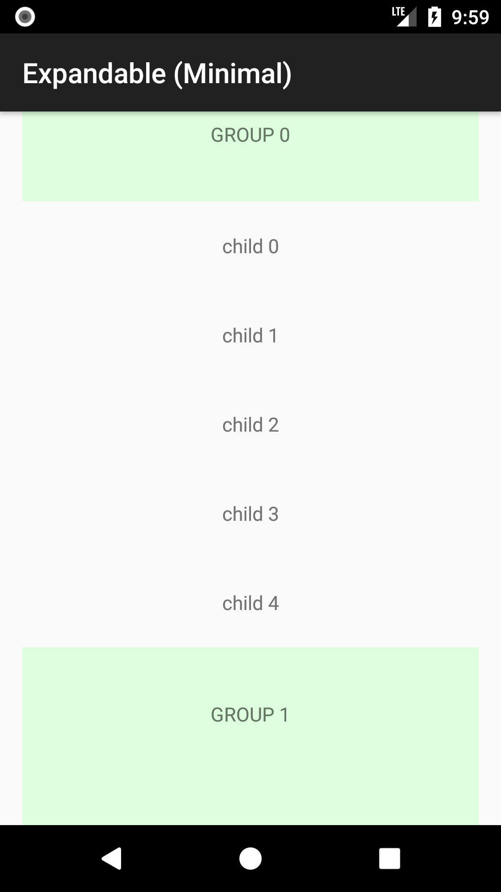
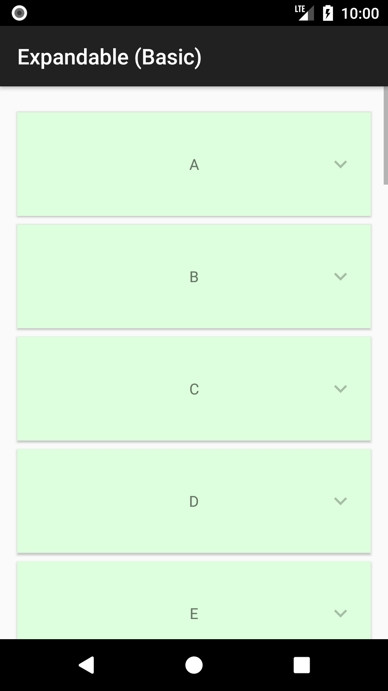
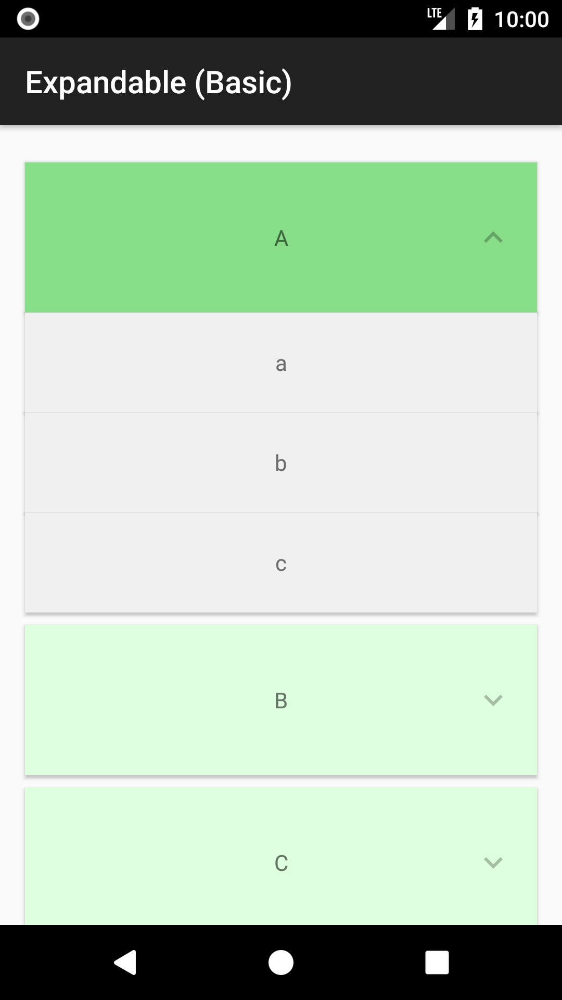
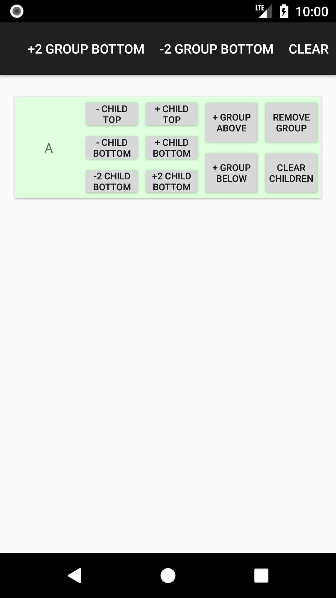
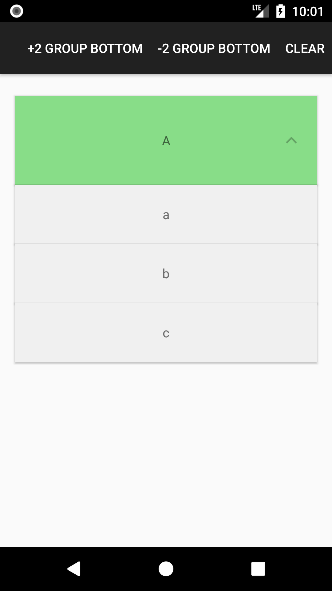

## &raquo; Minimal example

| Screenshot 1 | Screenshot 2 |
|--------------|--------------|
|  |  |

!!! tip ""
    [:octocat: See the source code on GitHub](https://github.com/h6ah4i/android-advancedrecyclerview/tree/master/example/src/main/java/com/h6ah4i/android/example/advrecyclerview/demo_e_minimal)

## &raquo; Basic example

| Screenshot 1 | Screenshot 2 |
|--------------|--------------|
|  |  |

!!! tip ""
    [:octocat: See the source code on GitHub](https://github.com/h6ah4i/android-advancedrecyclerview/tree/master/example/src/main/java/com/h6ah4i/android/example/advrecyclerview/demo_e_basic)

## &raquo; Add/Remove items

| Screenshot 1 | Screenshot 2 |
|--------------|--------------|
|  |  |

!!! tip ""
    [:octocat: See the source code on GitHub](https://github.com/h6ah4i/android-advancedrecyclerview/tree/master/example/src/main/java/com/h6ah4i/android/example/advrecyclerview/demo_e_add_remove)

## &raquo; Control initial state of groups

| Screenshot 1 | Screenshot 2 |
|--------------|--------------|
|  |  |

!!! tip ""
    [:octocat: See the source code on GitHub](https://github.com/h6ah4i/android-advancedrecyclerview/tree/master/example/src/main/java/com/h6ah4i/android/example/advrecyclerview/demo_e_already_expanded)

