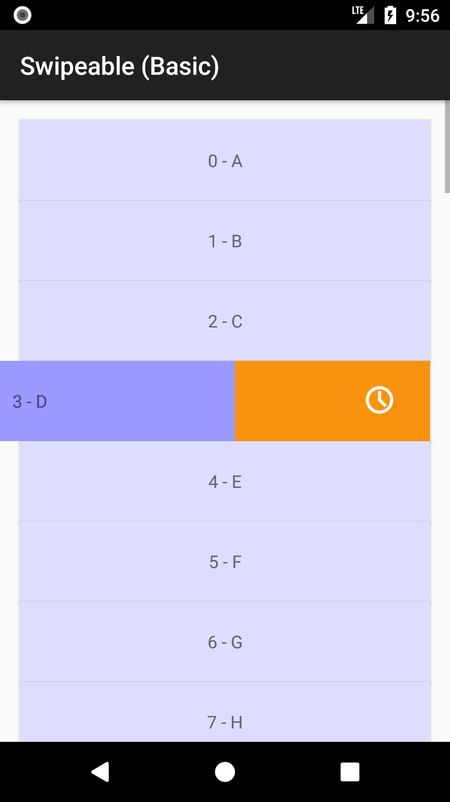
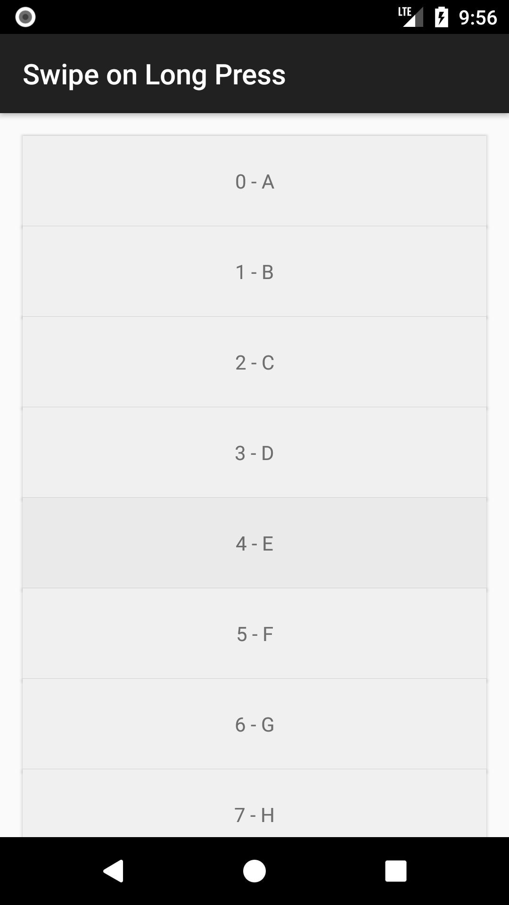
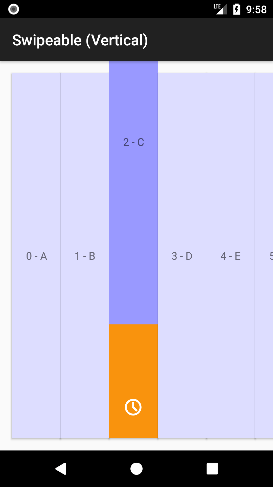
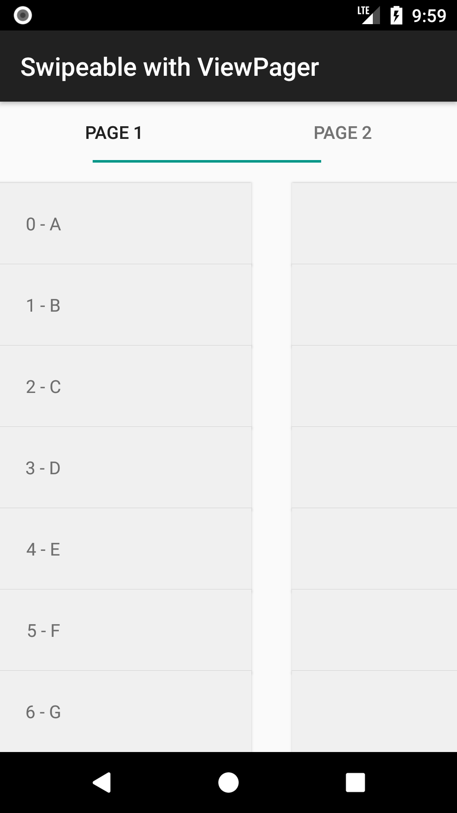

## &raquo; Minimal example

| Screenshot 1 | Screenshot 2 |
|--------------|--------------|
|  |  |

!!! tip ""
    [:octocat: See the source code on GitHub]({{ library.repo_tree_base }}/example/src/main/java/com/h6ah4i/android/example/advrecyclerview/demo_s_minimal)

## &raquo; Basic example

| Screenshot 1 | Screenshot 2 |
|--------------|--------------|
|  |  |

!!! tip ""
    [:octocat: See the source code on GitHub]({{ library.repo_tree_base }}/example/src/main/java/com/h6ah4i/android/example/advrecyclerview/demo_s_basic)

## &raquo; Start swiping on long press

| Screenshot 1 | Screenshot 2 |
|--------------|--------------|
|  |  |

!!! tip ""
    [:octocat: See the source code on GitHub]({{ library.repo_tree_base }}/example/src/main/java/com/h6ah4i/android/example/advrecyclerview/demo_s_longpress)

## &raquo; Buttons under swipeable items

| Screenshot 1 | Screenshot 2 |
|--------------|--------------|
|  |  |

!!! tip ""
    [:octocat: See the source code on GitHub]({{ library.repo_tree_base }}/example/src/main/java/com/h6ah4i/android/example/advrecyclerview/demo_s_button)

## &raquo; With vertical orientation

| Screenshot 1 | Screenshot 2 |
|--------------|--------------|
|  |  |

!!! tip ""
    [:octocat: See the source code on GitHub]({{ library.repo_tree_base }}/example/src/main/java/com/h6ah4i/android/example/advrecyclerview/demo_s_vertical)

## &raquo; With ViewPager

| Screenshot 1 | Screenshot 2 |
|--------------|--------------|
|  |  |

!!! tip ""
    [:octocat: See the source code on GitHub]({{ library.repo_tree_base }}/example/src/main/java/com/h6ah4i/android/example/advrecyclerview/demo_s_viewpager)
