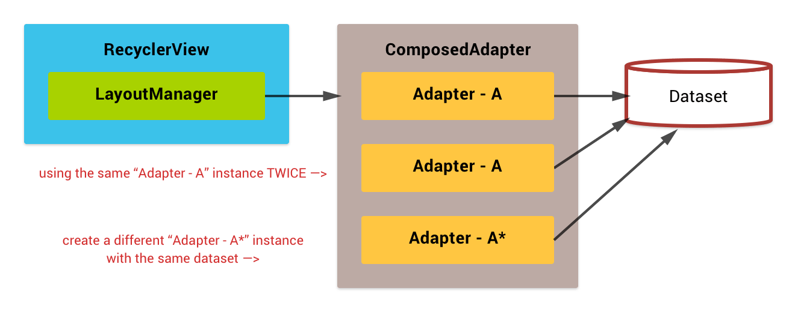

## What's `ComposedAdapter`?

The `ComposedAdapter` is an adapter which aggregates multiple adapters into one.


```java
dataSet = new DataSet();

composedAdapter.addAdapter(new AdapterA(new DataSet()));
composedAdapter.addAdapter(new AdapterB(new DataSet()));
composedAdapter.addAdapter(new AdapterC(new DataSet()));
```


!!! methods "Methods"
    - `ComposedChildAdapterTag ComposedAdapter.addAdapter(RecyclerView.Adapter adapter)`
    - `ComposedChildAdapterTag ComposedAdapter.addAdapter(RecyclerView.Adapter adapter, int position)`
    - `boolean ComposedAdapter.addAdapter(ComposedChildAdapterTag tag)`


The `ComposedAdapter` can hold the same child adapter instance multiple times like this;



```java
dataSet = new DataSet();

adapterA = new AdapterA(dataSet);
composedAdapter.addAdapter(adapterA);
composedAdapter.addAdapter(adapterA);

adapterA2 = new AdapterA(dataSet);
composedAdapter.addAdapter(adapterA2);
```

## Item position handling

The `ComposedAdapter` calls each child adapters as **segment**, also child adapter's local item position are called as **offset**.


!!! methods "Methods"
    - `int ComposedAdapter.getSegment(ComposedChildAdapterTag tag)`
    - `long ComposedAdapter.getSegmentedPosition(int flatPosition)`
    - `int ComposedAdapter.extractSegmentPart(long segmentedPosition)`
    - `int ComposedAdapter.extractSegmentOffsetPart(long segmentedPosition)`


## Item ID and ViewType handling

When merging adapters, we must take care about item IDs. They have to be unique in entire the dataset, but the problem is child datasets may contains the duplicated IDs. The `ItemIdComposer` is used to manage this problem.

### ItemIdComposer

This utility class provides several static methods to handle the *packed* item ID value.

Item IDs are expressed by 64 bits length integer in RecyclerView, so it can be embed multiple information by using bit operation technique. `ItemIdComposer` divides 64 bits into four chunks; *view type segment*, *group ID*, *child ID* and *reserved bit*.

| Bits       | Usage             |
|------------|-------------------|
| bit 63     | Reserved          |
| bit 62-56  | View type segment |
| bit 55-28  | Group ID          |
| bit 27-0   | Child ID          |

!!! methods "Methods"
    - `long ItemIdComposer.composeSegment(int segment, long wrappedId)`
    - `int ItemIdComposer.extractSegmentPart(long composedId)`
    - `long ItemIdComposer.extractExpandableGroupIdPart(long composedId)`
    - `long ItemIdComposer.extractExpandableChildIdPart(long composedId)`
    - `long ItemIdComposer.extractWrappedIdPart(long composedId)`
    - `boolean ItemIdComposer.isExpandableGroup(long composedId)`
    - `long ItemIdComposer.composeExpandableChildId(long groupId, long childId)`
    - `long ItemIdComposer.composeExpandableGroupId(long groupId)`


### ItemViewTypeComposer

Item view type has similar problem like item ID. The `ItemViewTypeCompser` manages packed item view type value that `ItemIdComposer` doing it for item ID.

Item view types are expressed by 32 bits integer in RecyclerView, and `ItemViewTypeCompser` divides it into three chunks; *expandable group flag*, *view type segment* and *wrapped view type code*.


| Bits       | Usage                  |
|------------|------------------------|
| bit 31     | Expandable group flag  (1: expandable group / 0: normal item) |
| bit 30-24  | View type segment      |
| bit 27-0   | Wrapped view type code |

!!! methods "Methods"
    - `int ItemViewTypeComposer.composeSegment(int segment, int wrappedViewType)`
    - `int ItemViewTypeComposer.extractSegmentPart(int composedViewType)`
    - `int ItemViewTypeComposer.extractWrappedViewTypePart(int composedViewType)`
    - `boolean ItemViewTypeComposer.isExpandableGroup(int composedViewType)`


## How to migrate to **WRAPPED** adapter?

Need to change several things to use `ComposedAdapter`. Refer to the [Tweak your Adapter to support adapter wrapping](/wrapper-adapter/migrate-to-wrapped-adapter) page for more details.
