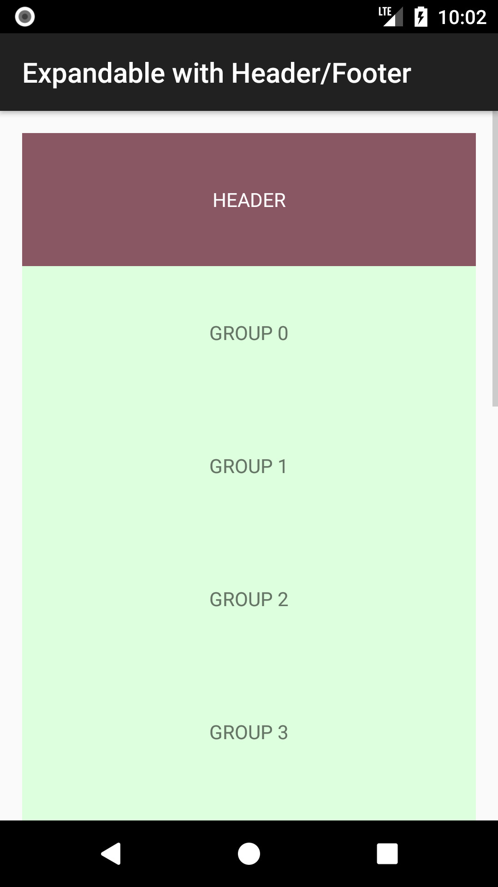
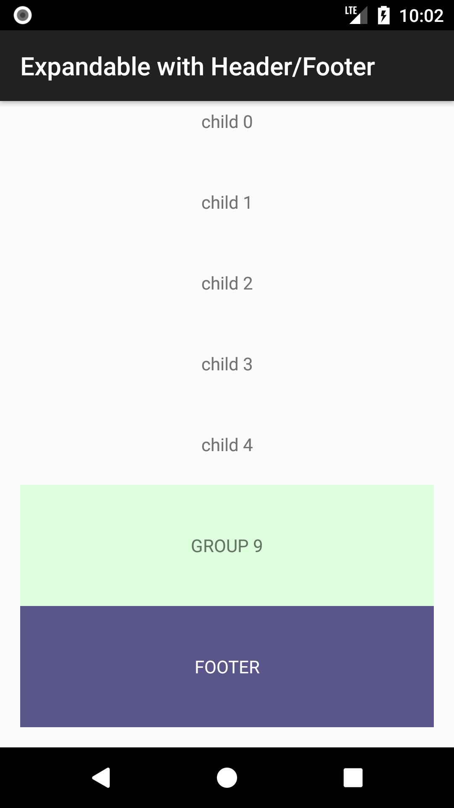
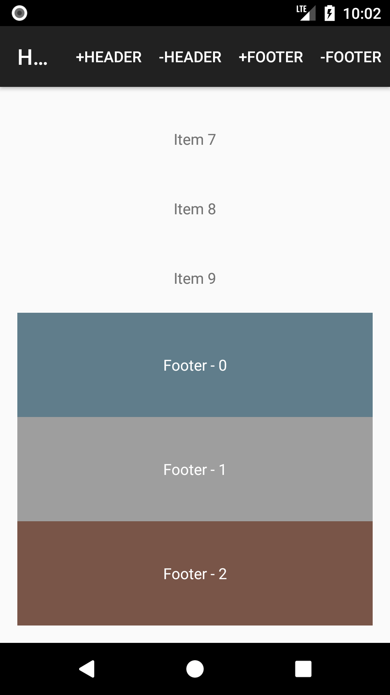
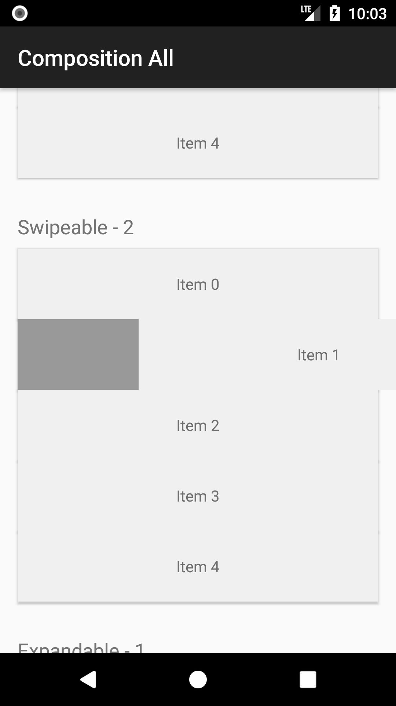
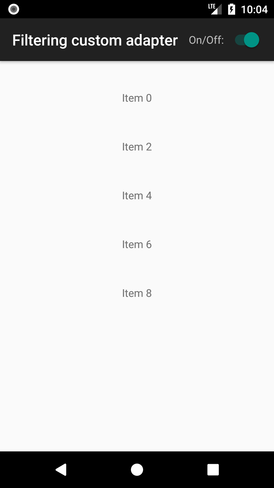
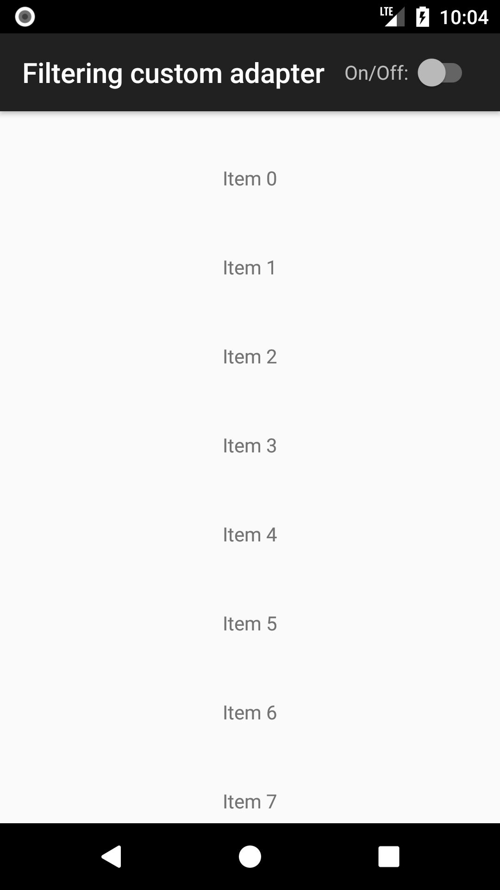

## Header/Footer

### &raquo; Minimal example

| Screenshot 1 | Screenshot 2 |
|--------------|--------------|
|  |  |

!!! tip ""
    [:octocat: See the source code on GitHub](https://github.com/h6ah4i/android-advancedrecyclerview/tree/master/example/src/main/java/com/h6ah4i/android/example/advrecyclerview/demo_hf_minimal)

### &raquo; With Expandable feature

| Screenshot 1 | Screenshot 2 |
|--------------|--------------|
|  |  |

!!! tip ""
    [:octocat: See the source code on GitHub](https://github.com/h6ah4i/android-advancedrecyclerview/tree/master/example/src/main/java/com/h6ah4i/android/example/advrecyclerview/demo_hf_e)

### &raquo; Add/Remove items

| Screenshot 1 | Screenshot 2 |
|--------------|--------------|
|  |  |

!!! tip ""
    [:octocat: See the source code on GitHub](https://github.com/h6ah4i/android-advancedrecyclerview/tree/master/example/src/main/java/com/h6ah4i/android/example/advrecyclerview/demo_hf_add_remove)

## ComposedAdapter

### &raquo; Composition of all features (Draggable, Swipeable, Expandable, Header/Footer, Section)

| Screenshot 1 | Screenshot 2 |
|--------------|--------------|
|  |  |

!!! tip ""
    [:octocat: See the source code on GitHub](https://github.com/h6ah4i/android-advancedrecyclerview/tree/master/example/src/main/java/com/h6ah4i/android/example/advrecyclerview/demo_composition_all)

## Custom wrapper adapter

### &raquo; Insertion custom wrapper adapter

| Screenshot 1 | Screenshot 2 |
|--------------|--------------|
|  |  |

!!! tip ""
    [:octocat: See the source code on GitHub](https://github.com/h6ah4i/android-advancedrecyclerview/tree/master/example/src/main/java/com/h6ah4i/android/example/advrecyclerview/demo_wa_insertion)

### &raquo; Filtering custom wrapper adapter

| Screenshot 1 | Screenshot 2 |
|--------------|--------------|
|  |  |

!!! tip ""
    [:octocat: See the source code on GitHub](https://github.com/h6ah4i/android-advancedrecyclerview/tree/master/example/src/main/java/com/h6ah4i/android/example/advrecyclerview/demo_wa_filtering)

